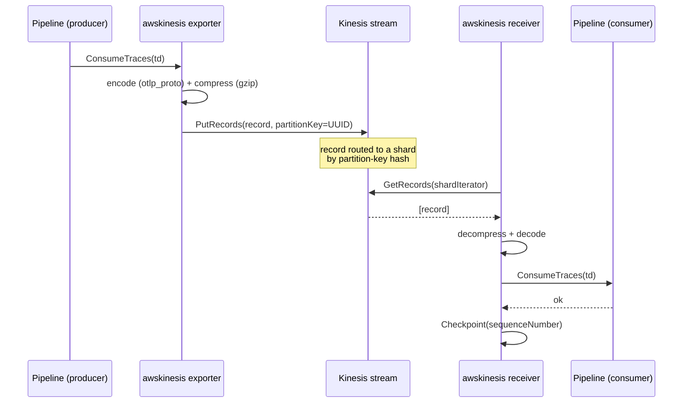
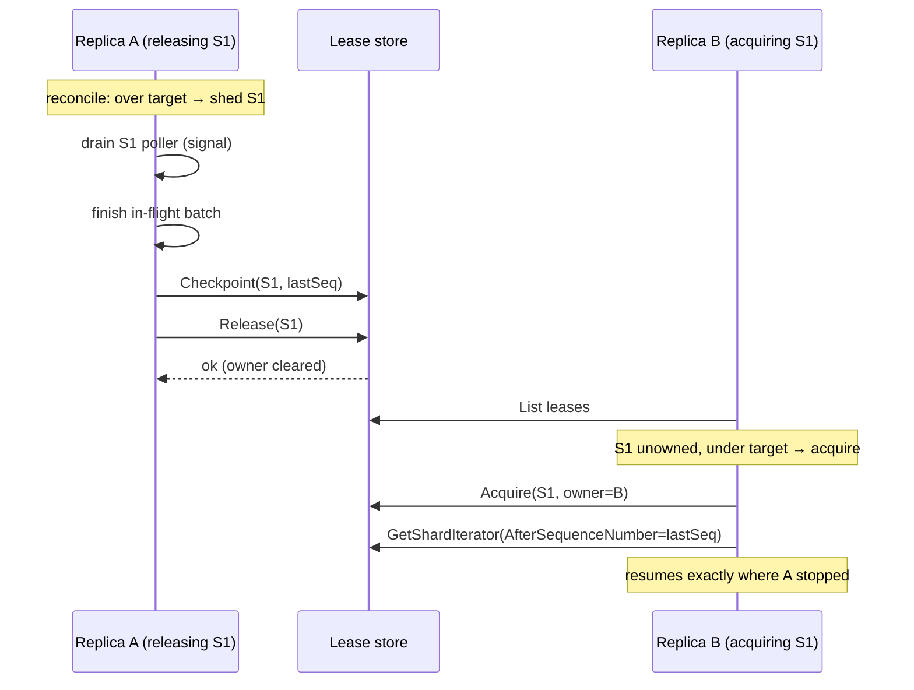
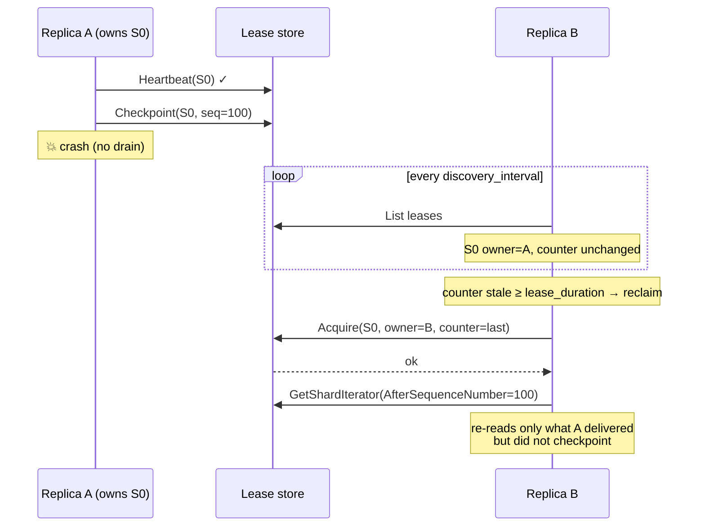
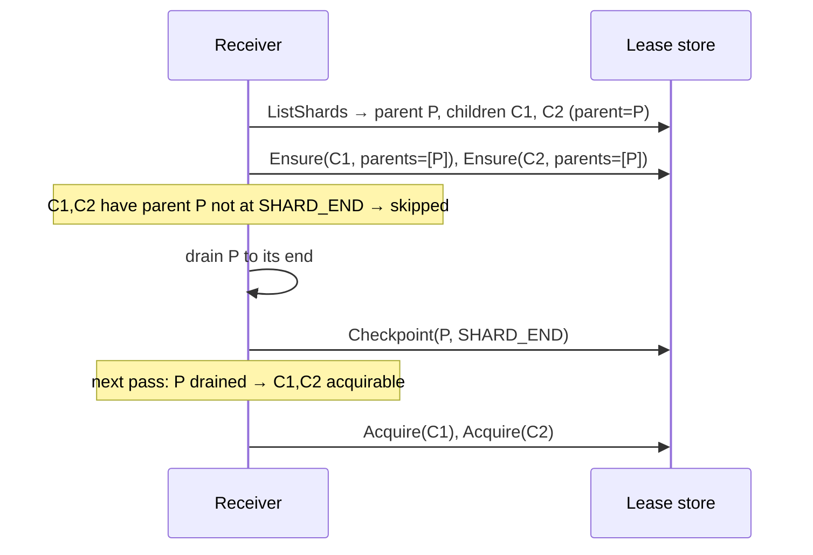

# User guide

This guide covers configuring and operating the paired Kinesis exporter and
receiver: every setting with an example, and sequence diagrams for the
runtime behaviors that matter operationally — round trip, shard rebalancing,
graceful handoff, crash recovery, and resharding.

For the architecture, see [`DESIGN.md`](../DESIGN.md); for the decisions behind
specific behaviors, see the [ADRs](adr/).

> **Status:** proof of concept. Traces only. Several knobs the architecture
> calls for are deliberately deferred — see [ADR-0005](adr/0005-poc-milestone-scope-cuts.md)
> and [Limitations](#limitations).

## Contents

- [Building a collector](#building-a-collector)
- [Testing against real AWS](#testing-against-real-aws) — **start here to try it end-to-end**
- [Exporter configuration](#exporter-configuration)
- [Receiver configuration](#receiver-configuration)
- [Lease backends](#lease-backends)
- [Behavior](#behavior)
  - [End-to-end round trip](#end-to-end-round-trip)
  - [Shard acquisition and fair-share rebalancing](#shard-acquisition-and-fair-share-rebalancing)
  - [Graceful handoff and shutdown](#graceful-handoff-and-shutdown)
  - [Crash recovery](#crash-recovery)
  - [Resharding](#resharding)
  - [Per-record failure handling](#per-record-failure-handling)
- [Tuning](#tuning)
- [Limitations](#limitations)

## Building a collector

Both components are registered with the OpenTelemetry Collector through their
`NewFactory()` functions. The repo ships a small custom distribution at
[`cmd/otelcol-kinesis`](../cmd/otelcol-kinesis) that wires them alongside the
OTLP receiver, file/debug exporters, and the batch processor. Build it:

```sh
make collector        # produces bin/otelcol-kinesis
make docker           # builds the otelcol-kinesis:dev image
```

To embed the components in your own distribution, import the factories:

```go
import (
    "github.com/jrglee/opentelemetry-kinesis-stream/exporter/awskinesisexporter"
    "github.com/jrglee/opentelemetry-kinesis-stream/receiver/awskinesisreceiver"
)
```

Both register under the component type `awskinesis`.

## Testing against real AWS

This walkthrough takes you from nothing to a verified round trip on real
Kinesis and DynamoDB, then exercises rebalancing, failover, and resharding so
you can watch the distributed behavior with your own eyes. It is the L3 path of
the [testing strategy](adr/0004-testing-strategy-middleware-ministack-real-aws.md);
the local `make e2e` stack (MiniStack) is the L2 rehearsal of the same flow.

You need: AWS credentials with permission to create a Kinesis stream and a
DynamoDB table, the AWS CLI, Docker (or `make collector` for a local binary),
and `telemetrygen` for load (`go install
github.com/open-telemetry/opentelemetry-collector-contrib/cmd/telemetrygen@latest`).

Throughout, set a region and let the AWS SDK resolve real credentials — **do
not set `endpoint`** in the configs (that override is only for emulators).

```sh
export AWS_REGION=us-east-1
export STREAM=otel-traces
export LEASE_TABLE=otel-kinesis-leases
```

### 1. Provision the stream and lease table

Create the stream with **2 shards** so ownership has something to split:

```sh
aws kinesis create-stream --stream-name "$STREAM" --shard-count 2
aws kinesis wait stream-exists --stream-name "$STREAM"

aws dynamodb create-table \
  --table-name "$LEASE_TABLE" \
  --attribute-definitions AttributeName=leaseKey,AttributeType=S \
  --key-schema AttributeName=leaseKey,KeyType=HASH \
  --billing-mode PAY_PER_REQUEST
aws dynamodb wait table-exists --table-name "$LEASE_TABLE"
```

### 2. Grant IAM permissions

The collector process needs, on the stream:
`kinesis:DescribeStreamSummary`, `kinesis:ListShards`,
`kinesis:GetShardIterator`, `kinesis:GetRecords`, `kinesis:PutRecords`; and on
the lease table: `dynamodb:Scan`, `dynamodb:GetItem`, `dynamodb:PutItem`,
`dynamodb:UpdateItem`. Attach these to the role or user whose credentials the
collector runs with (instance role, IRSA, or `AWS_*` environment variables).

### 3. Write the producer and consumer configs

`producer.yaml` — OTLP in, Kinesis out:

```yaml
receivers:
  otlp:
    protocols:
      grpc:
        endpoint: 0.0.0.0:4317
processors:
  batch:
exporters:
  awskinesis:
    stream_name: otel-traces
    region: us-east-1
    encoding: otlp_proto
    compression: gzip
service:
  pipelines:
    traces:
      receivers: [otlp]
      processors: [batch]
      exporters: [awskinesis]
```

`consumer.yaml` — Kinesis in, your downstream out (here `debug` to stdout, plus
a real OTLP backend if you have one). Use the **DynamoDB** lease backend and a
**stable `worker_id`** per replica:

```yaml
receivers:
  awskinesis:
    stream_name: otel-traces
    region: us-east-1
    encoding: otlp_proto
    compression: gzip
    lease_backend: dynamodb
    lease_table: otel-kinesis-leases
    worker_id: ${env:WORKER_ID}
    lease_duration: 30s
    heartbeat_interval: 5s
    discovery_interval: 15s
exporters:
  debug:
    verbosity: basic
service:
  pipelines:
    traces:
      receivers: [awskinesis]
      exporters: [debug]
```

### 4. Run a producer and one consumer

```sh
make collector   # bin/otelcol-kinesis

# terminal 1 — producer on :4317
bin/otelcol-kinesis --config file:producer.yaml

# terminal 2 — consumer "c1"
WORKER_ID=c1 bin/otelcol-kinesis --config file:consumer.yaml
```

The consumer logs `kinesis receiver started`. Confirm it owns both shards:

```sh
aws dynamodb scan --table-name "$LEASE_TABLE" \
  --projection-expression 'leaseKey, leaseOwner, checkpoint'
```

You should see two `leaseKey` rows both owned by `c1`.

### 5. Generate load and verify the round trip

```sh
telemetrygen traces --traces 200 --rate 0 \
  --otlp-endpoint localhost:4317 --otlp-insecure
```

Watch the consumer's `debug` output report received spans, and watch the
checkpoints advance from `TRIM_HORIZON` to real sequence numbers:

```sh
aws dynamodb scan --table-name "$LEASE_TABLE" \
  --projection-expression 'leaseKey, leaseOwner, checkpoint'
```

> Tip: to spread records across **both** shards (so a two-replica test
> distributes load), keep records small — one span per record gives one random
> partition key per span. A large `batchprocessor` batch becomes one record
> with one key and can land entirely on one shard.

### 6. Observe fair-share rebalancing

Start a **second** consumer with a different `worker_id`:

```sh
# terminal 3 — consumer "c2"
WORKER_ID=c2 bin/otelcol-kinesis --config file:consumer.yaml
```

Within a couple of `discovery_interval`s, scan the lease table again — the two
shards should now be split, one owned by `c1` and one by `c2`. That is the
leaderless fair-share rebalancing converging
([ADR-0008](adr/0008-leaderless-fair-share-rebalancing.md)). Generate more load
and confirm both consumers report spans.

### 7. Observe failover and graceful handoff

- **Graceful (scale-down):** stop `c2` with `Ctrl-C`. It drains: finishes its
  in-flight batch, checkpoints, and releases its shard. `c1` picks the shard up
  within a discovery pass and resumes from `c2`'s checkpoint — no re-read
  ([ADR-0009](adr/0009-graceful-lease-handoff-and-shutdown.md)). The lease table
  shows the shard move to `c1`.
- **Crash:** `kill -9` a consumer instead. It cannot drain, so its lease simply
  stops heartbeating; after `lease_duration` the survivor reclaims it and
  resumes from the last checkpoint, re-reading at most the final uncheckpointed
  batch.

### 8. Observe parent-drains-before-child on a reshard

Trigger a real split by raising the shard count:

```sh
aws kinesis update-shard-count --stream-name "$STREAM" \
  --target-shard-count 4 --scaling-type UNIFORM_SCALING
```

The consumers keep reading the original (now closed) parent shards to the end,
write `SHARD_END` for each, and only then begin the new child shards — preserving
per-key ordering. Watch the lease table: child rows appear with `parentShardId`
set and stay unowned until the parent rows reach `checkpoint = SHARD_END`.

### 9. Clean up

```sh
aws kinesis delete-stream --stream-name "$STREAM"
aws dynamodb delete-table --table-name "$LEASE_TABLE"
```

> A two-shard stream plus a PAY_PER_REQUEST table left running for an hour
> costs cents, but delete them when done.

## Exporter configuration

The exporter marshals each `ConsumeTraces` call into a single Kinesis record
and writes it with `PutRecords` using a random partition key.

| Setting           | Type   | Default      | Required | Description |
|-------------------|--------|--------------|----------|-------------|
| `stream_name`     | string | —            | yes      | Target Kinesis Data Stream. |
| `region`          | string | —            | yes      | AWS region of the stream. |
| `endpoint`        | string | (SDK default)| no       | Override the AWS endpoint URL. Set this for emulators (e.g. `http://ministack:4566`). |
| `encoding`        | string | `otlp_proto` | no       | Wire format. Only `otlp_proto` is implemented; `otlp_json` and `otel_arrow` are reserved and rejected at validation. |
| `compression`     | string | `none`       | no       | Payload codec. `none` or `gzip`; `zstd` is reserved and rejected. |
| `max_record_size` | int    | `1048576`    | no       | Post-compression byte ceiling per record. A larger payload is dropped with a log line (no repacking yet). The Kinesis hard limit is 1 MiB on the standard API. |

Credentials come from the standard AWS SDK chain (environment, shared config,
or IAM role). For an emulator, set dummy credentials via environment.

### Example

```yaml
exporters:
  awskinesis:
    stream_name: otel-traces
    region: us-east-1
    encoding: otlp_proto
    compression: gzip
    max_record_size: 1048576

service:
  pipelines:
    traces:
      receivers: [otlp]
      processors: [batch]
      exporters: [awskinesis]
```

The wire layout (encoding + compression, headerless) must match what the
receiver expects — they are agreed by configuration on both ends.

## Receiver configuration

The receiver claims shards through a lease store, polls each owned shard with
`GetRecords`, decompresses and decodes records, hands telemetry to the
pipeline, and checkpoints after downstream acceptance.

| Setting              | Type     | Default      | Required | Description |
|----------------------|----------|--------------|----------|-------------|
| `stream_name`        | string   | —            | yes      | Source Kinesis Data Stream. |
| `region`             | string   | —            | yes      | AWS region of the stream. |
| `endpoint`           | string   | (SDK default)| no       | Override the AWS endpoint URL (Kinesis **and** DynamoDB). Set for emulators. |
| `encoding`           | string   | `otlp_proto` | no       | Wire format expected on records. Must match the exporter. |
| `compression`        | string   | `none`       | no       | Codec expected on records. Must match the exporter. |
| `poll_interval`      | duration | `250ms`      | no       | Delay between `GetRecords` calls on a shard after an empty response. Stay under the 5-reads/s/shard Kinesis limit. |
| `max_records`        | int      | `10000`      | no       | Cap on records per `GetRecords` (1–10000; 10000 is the Kinesis maximum). |
| `worker_id`          | string   | (random UUID)| no       | Unique id for this replica. A **stable** id across restarts is recommended in production so a restarting replica reclaims its own leases. Two replicas sharing an id will fight. |
| `lease_backend`      | string   | `memory`     | no       | `memory` (single replica, no durability) or `dynamodb` (multi-replica, durable). See [Lease backends](#lease-backends). |
| `lease_table`        | string   | —            | if dynamodb | DynamoDB lease table name. |
| `lease_duration`     | duration | `30s`        | no       | A lease whose heartbeat lapses for this long may be reclaimed by a peer. Must be greater than `heartbeat_interval`. |
| `heartbeat_interval` | duration | `5s`         | no       | How often a poller re-asserts (heartbeats) its lease. |
| `discovery_interval` | duration | `30s`        | no       | How often a replica re-lists shards and runs the rebalancing pass. |

### Example (single replica, development)

```yaml
receivers:
  awskinesis:
    stream_name: otel-traces
    region: us-east-1
    encoding: otlp_proto
    compression: gzip
    lease_backend: memory

service:
  pipelines:
    traces:
      receivers: [awskinesis]
      exporters: [otlp]   # forward downstream
```

### Example (multi-replica, production)

```yaml
receivers:
  awskinesis:
    stream_name: otel-traces
    region: us-east-1
    encoding: otlp_proto
    compression: gzip
    lease_backend: dynamodb
    lease_table: otel-kinesis-leases
    worker_id: ${env:POD_NAME}     # stable per replica
    lease_duration: 30s
    heartbeat_interval: 5s
    discovery_interval: 15s
```

## Lease backends

Shard ownership and checkpoints live in a *lease store*.

**`memory`** keeps everything in-process. It does not coordinate across
replicas and loses all checkpoints on restart (the replica re-reads every
shard from `TRIM_HORIZON`). Use it only for single-replica development. The
receiver logs a warning at startup when this backend is selected.

**`dynamodb`** persists leases in a table whose columns mirror KCL's lease
table, so a stock KCL consumer can share the same table without re-ingesting.
Provision the table with a single string hash key named `leaseKey`:

```sh
aws dynamodb create-table \
  --table-name otel-kinesis-leases \
  --attribute-definitions AttributeName=leaseKey,AttributeType=S \
  --key-schema AttributeName=leaseKey,KeyType=HASH \
  --billing-mode PAY_PER_REQUEST
```

Columns written: `leaseKey` (shard id), `leaseOwner` (worker id, absent when
unowned), `leaseCounter` (fencing token), `checkpoint` (sequence number or the
sentinels `TRIM_HORIZON` / `SHARD_END`), and `parentShardId` (comma-joined
parents). KCL's other columns are left to KCL's defaults.

The receiver's IAM role needs `kinesis:DescribeStream*`, `kinesis:ListShards`,
`kinesis:GetShardIterator`, `kinesis:GetRecords` on the stream, and
`dynamodb:Scan`, `dynamodb:PutItem`, `dynamodb:UpdateItem`, `dynamodb:GetItem`
on the lease table.

## Behavior

### End-to-end round trip



The checkpoint is written **after** downstream acceptance, so a crash before
the consumer accepts the data re-reads it rather than losing it.

### Shard acquisition and fair-share rebalancing

Every replica independently runs the same fair-share computation each
`discovery_interval`. There is no leader. `target = ceil(activeShards /
activeWorkers)`, where an active worker is a distinct heartbeating owner (plus
self). See [ADR-0008](adr/0008-leaderless-fair-share-rebalancing.md).

```mermaid
sequenceDiagram
    participant A as Replica A (owns S0, S1)
    participant L as Lease store
    participant B as Replica B (new)

    Note over A: target = ceil(2/1) = 2 (alone)
    A->>L: heartbeat S0, S1

    Note over B: B starts, sees S0,S1 owned by A
    B->>L: List leases
    Note over B: target = ceil(2/2) = 1; owns 0;<br/>nothing free → steal one
    B->>L: Acquire(S1, owner=B, counter=n)
    L-->>B: ok (counter=n+1)

    A->>L: Heartbeat(S1, counter=n)
    L-->>A: conflict (counter advanced)
    Note over A: A lost S1 → stops its S1 poller

    Note over A: target now 1, owns S0 → balanced
    Note over B: owns S1 → balanced
```

A new replica becomes visible by taking one shard (a *steal*); thereafter
over-target owners shed surplus **cooperatively** (see next section) and
under-target peers pick up the freed shards. Convergence is even-as-possible:
`S=2,W=2 → 1-1`; `S=3,W=2 → 2-1` (stable).

### Graceful handoff and shutdown

When a worker sheds a surplus shard (rebalance) or the collector shuts down,
the poller **drains**: it finishes the in-flight batch, persists that batch's
checkpoint, and only then releases the lease. The next owner resumes from a
current checkpoint with no re-delivered records. See
[ADR-0009](adr/0009-graceful-lease-handoff-and-shutdown.md).



On collector shutdown the receiver stops shard discovery, drains every poller,
and waits — falling back to a hard cancel only if the collector's shutdown
deadline fires.

### Crash recovery

A crashed replica cannot drain, so its leases simply stop heartbeating. After
`lease_duration` a peer reclaims them and resumes from the last persisted
checkpoint — re-reading at most the final uncheckpointed batch (at-least-once).



Set a **stable `worker_id`** so a quickly-restarting replica reclaims its own
leases immediately rather than waiting out `lease_duration`.

### Resharding

Kinesis shards split and merge. A child shard must not be read until its
parents are fully drained, or per-key ordering breaks. The coordinator gates
acquisition on parent state: a child is only a candidate once every parent's
checkpoint is `SHARD_END`.



> Reshard handling is implemented in the acquisition path but not yet verified
> against a live shard split — see [Limitations](#limitations).

### Per-record failure handling

Within a batch the receiver distinguishes failures so it never silently drops
valid telemetry:

```mermaid
sequenceDiagram
    participant RX as Receiver
    participant C as Pipeline (consumer)
    participant L as Lease store

    RX->>RX: decompress + decode record
    alt decode/decompress fails
        Note over RX: unprocessable bytes → skip, advance past
    else permanent downstream rejection
        RX->>C: ConsumeTraces
        C-->>RX: permanent error
        Note over RX: skip, advance past
    else transient downstream rejection
        RX->>C: ConsumeTraces
        C-->>RX: error (backpressure)
        Note over RX: do NOT advance; re-read from checkpoint
    else success
        RX->>C: ConsumeTraces
        C-->>RX: ok
    end
    RX->>L: Checkpoint(lastGoodSeq)
```

A transient failure stops the batch and re-reads it, so spans are retried, not
lost, under backpressure. A failed or expired shard iterator is re-opened from
the persisted checkpoint rather than reused.

## Tuning

- **`heartbeat_interval` vs `lease_duration`.** The heartbeat must comfortably
  beat the lease expiry. A rule of thumb is `lease_duration ≈ 3–6 ×
  heartbeat_interval`. Too tight risks false reclaims of a healthy owner under
  a latency spike; too loose slows crash recovery.
- **`discovery_interval`.** Drives how fast rebalancing converges and how fast
  a crashed replica's shards are noticed. Lower converges faster at the cost of
  more `ListShards` / `Scan` traffic. Mind the 5-TPS `ListShards` account
  limit when many replicas start together.
- **`poll_interval`.** Trades latency for `GetRecords` call volume on idle
  shards. The 5-reads/s/shard limit is the ceiling.
- **Partition keys.** The exporter uses a random key per record, so records
  spread across shards. If you batch many spans into one record (large
  `batchprocessor` settings), you produce few keys and skew the distribution —
  size batches with shard balance in mind.

## Limitations

This is a proof of concept. Deliberately deferred (see
[ADR-0005](adr/0005-poc-milestone-scope-cuts.md)):

- Traces only — no metrics or logs.
- `otlp_proto` encoding and `none`/`gzip` compression only; `otlp_json`,
  `otel_arrow`, and `zstd` are reserved names that fail validation.
- Random partition keys only — no tag-hash strategy.
- No microbatch repacking — a record over `max_record_size` is dropped.
- Resharding is gated in code but unverified against a live split.
- Rebalancing bootstrap uses a forced steal (at-least-once for one shard at
  worker-join); planned sheds and shutdowns are graceful (effectively
  exactly-once). Exactly-once is not claimed across crashes.
