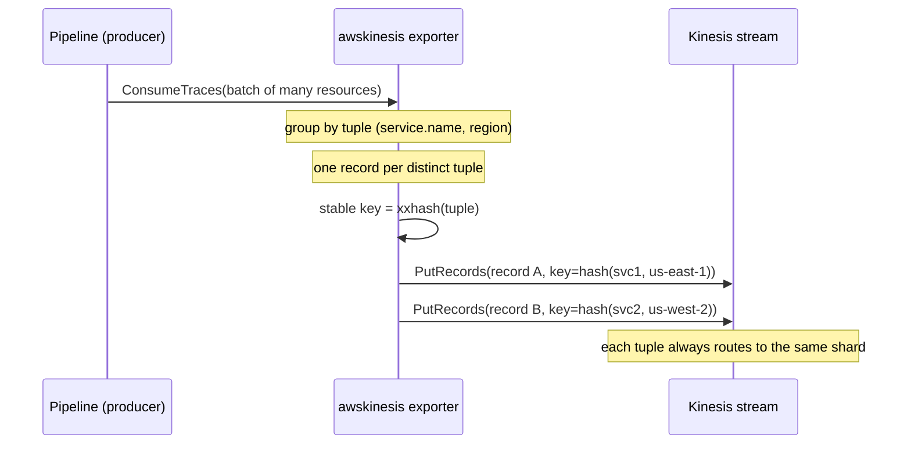
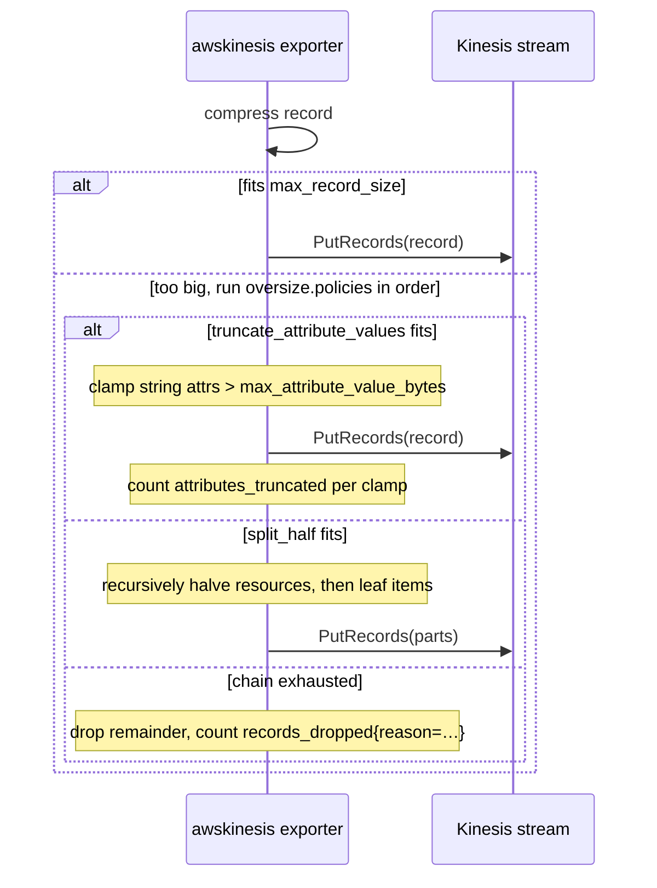
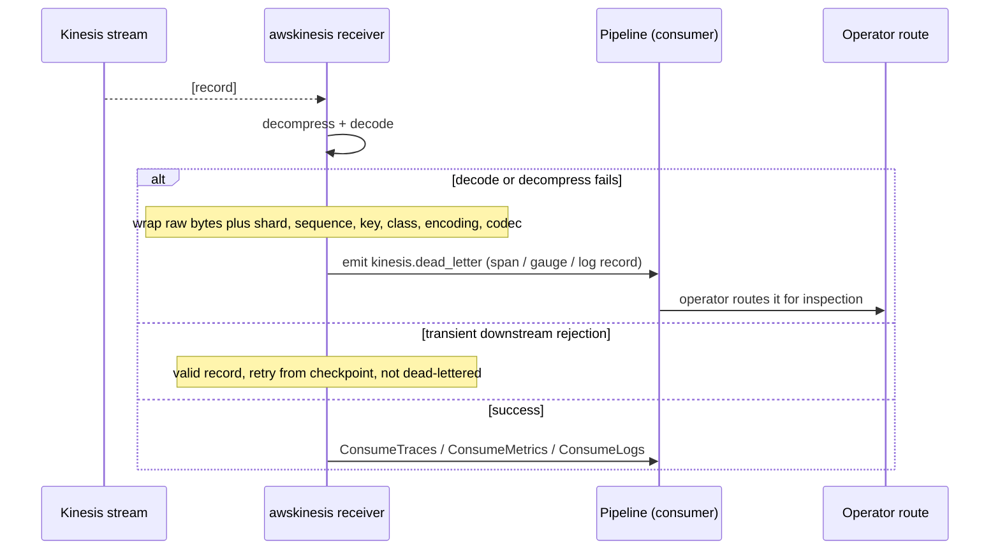
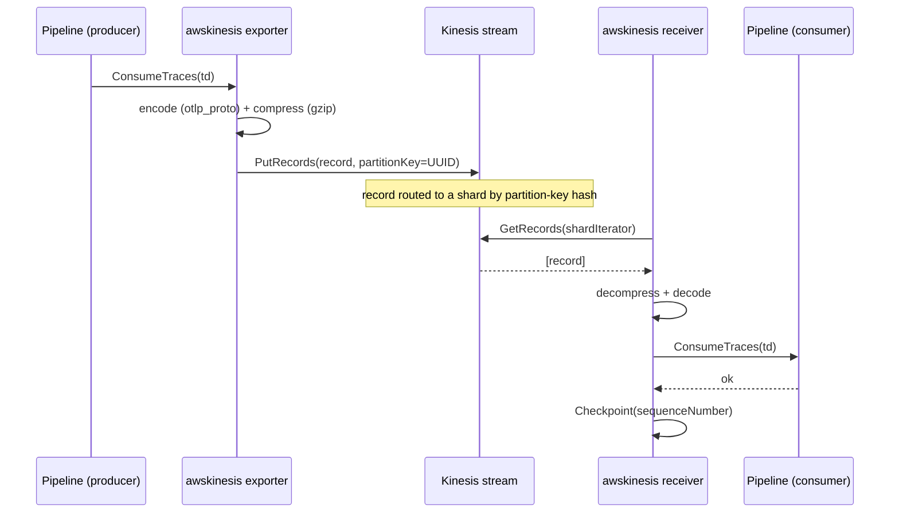
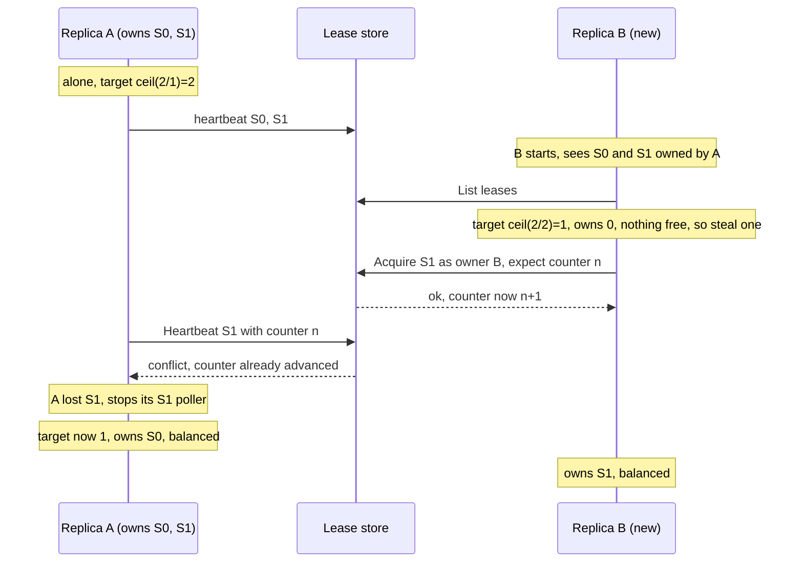
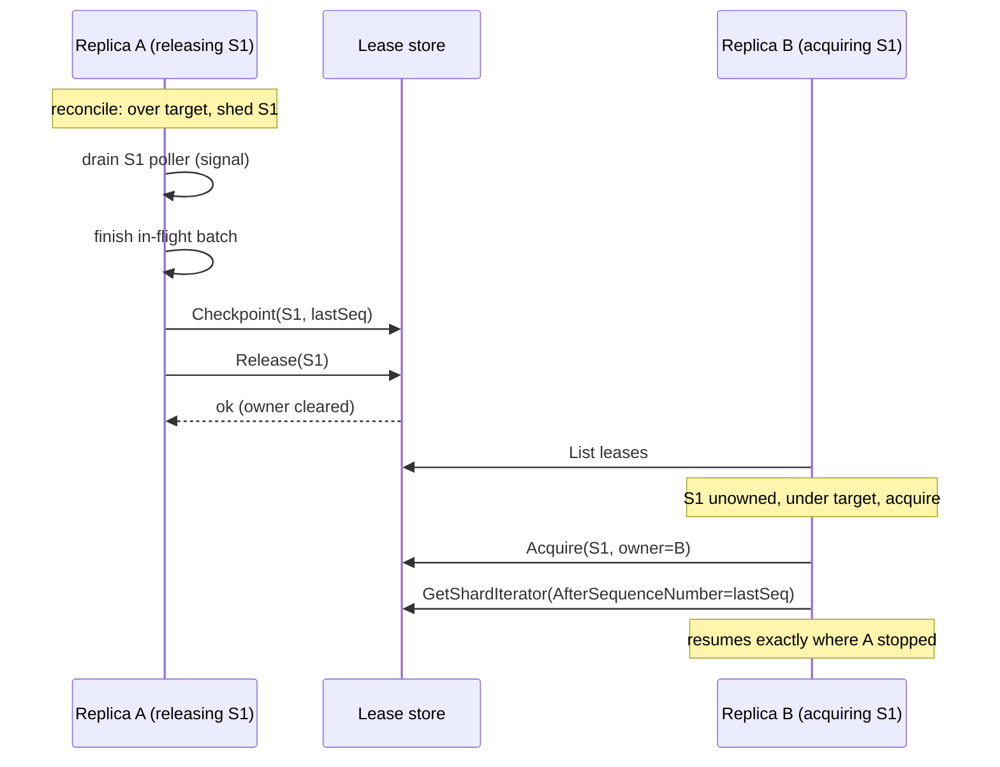
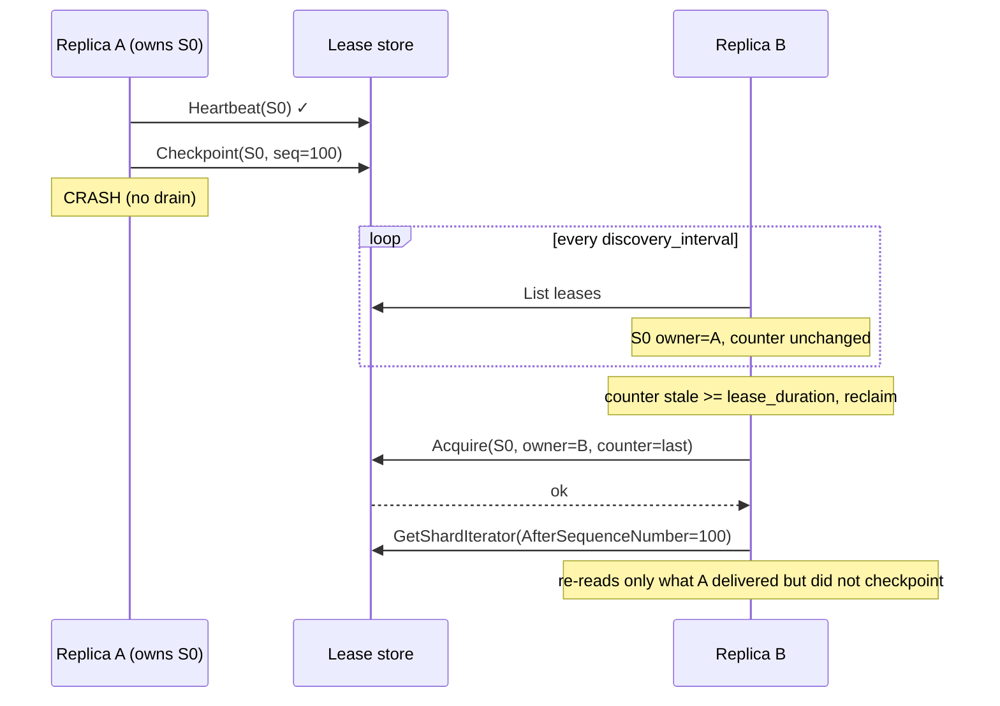
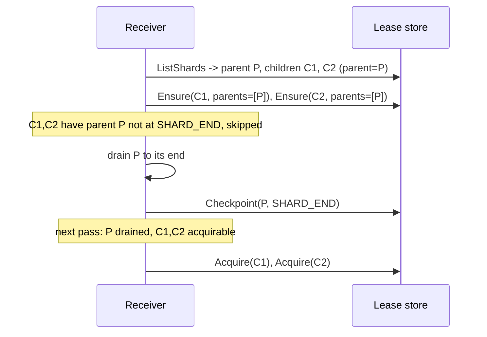
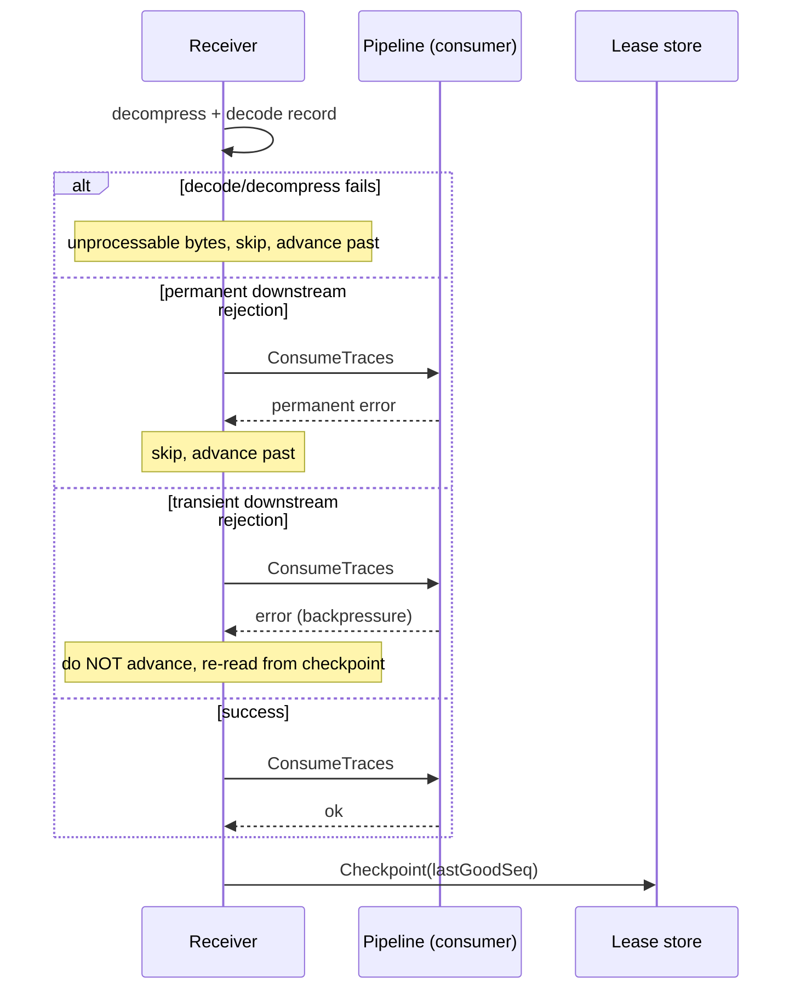

# User guide

This guide is everything you need to configure, operate, and test the paired
Kinesis exporter and receiver. It documents every setting with an example,
walks through testing against real AWS, and uses sequence diagrams to describe
the runtime behaviors that matter operationally — round trip, shard
rebalancing, graceful handoff, crash recovery, and resharding. You can treat
the components as a black box; nothing here requires reading the source.

> **Status:** proof of concept. All three signals (traces, metrics, logs),
> `otlp_proto`/`otlp_json`/`otel_arrow` encodings,
> `none`/`gzip`/`zstd`/`snappy`/`x-snappy-framed`/`zlib`/`deflate`
> compression. Known gaps and follow-ups (live-reshard verification, EFO)
> are in [Limitations](#limitations).

## Contents

- [Building a collector](#building-a-collector)
- [Signals (traces, metrics, and logs)](#signals-traces-metrics-and-logs)
- [Testing against real AWS](#testing-against-real-aws) — **start here to try it end-to-end**
- [Exporter configuration](#exporter-configuration)
  - [Encodings](#encodings)
  - [Choosing compression](#choosing-compression)
  - [Tag-grouped microbatching](#tag-grouped-microbatching)
  - [Oversize records](#oversize-records)
- [Receiver configuration](#receiver-configuration)
  - [Dead-letter handling](#dead-letter-handling)
- [Lease backends](#lease-backends)
- [Metrics with InfluxDB line protocol](#metrics-with-influxdb-line-protocol)
- [Behavior](#behavior)
  - [End-to-end round trip](#end-to-end-round-trip)
  - [Shard acquisition and fair-share rebalancing](#shard-acquisition-and-fair-share-rebalancing)
  - [Graceful handoff and shutdown](#graceful-handoff-and-shutdown)
  - [Crash recovery](#crash-recovery)
  - [Resharding](#resharding)
  - [Per-record failure handling](#per-record-failure-handling)
- [Observability](#observability)
- [Tuning](#tuning)
- [Limitations](#limitations)

## Signals (traces, metrics, and logs)

Both components register `WithTraces`, `WithMetrics`, and `WithLogs`, so each
can serve a traces, metrics, or logs pipeline. The choice is the pipeline you
attach the component to.

A given Kinesis stream carries **one signal**. The wire layout has no signal
header, so the consumer must decode records as the same signal the producer
encoded. Run a separate stream per signal (e.g. `otel-traces`, `otel-metrics`,
`otel-logs`) and point each pipeline at its own stream. Mixing signals on one
stream is unsupported and decodes will fail on the consumer.

Everything in this guide — compression, partition keys, leasing, rebalancing,
checkpointing — behaves identically across all three signals. Examples that
show a `traces:` pipeline work the same with `metrics:` or `logs:`; swap the
keyword and use the appropriate source and sink.

## Building a collector

Both components are registered with the OpenTelemetry Collector through their
`NewFactory()` functions. The repo ships a small custom distribution at
[`cmd/otelcol-kinesis`](../cmd/otelcol-kinesis) that wires them alongside the
OTLP receiver, file/debug exporters, and the batch processor. Build it:

```sh
make collector        # produces bin/otelcol-kinesis
make docker           # builds the otelcol-kinesis:dev image
```

To embed the components in your own distribution, import the factories:

```go
import (
    "github.com/jrglee/opentelemetry-kinesis-stream/exporter/awskinesisexporter"
    "github.com/jrglee/opentelemetry-kinesis-stream/receiver/awskinesisreceiver"
)
```

Both register under the component type `awskinesis`.

## Testing against real AWS

This walkthrough takes you from nothing to a verified round trip on real
Kinesis and DynamoDB, then exercises rebalancing, failover, and resharding so
you can watch the distributed behavior with your own eyes.

You need: AWS credentials with permission to create a Kinesis stream and a
DynamoDB table, the AWS CLI, Docker (or `make collector` for a local binary),
and `telemetrygen` for load (`go install
github.com/open-telemetry/opentelemetry-collector-contrib/cmd/telemetrygen@latest`).

Throughout, set a region and let the AWS SDK resolve real credentials — **do
not set `endpoint`** in the configs (that override is only for emulators).

```sh
export AWS_REGION=us-east-1
export STREAM=otel-traces
export LEASE_TABLE=otel-kinesis-leases
```

### 1. Provision the stream and lease table

Create the stream with **2 shards** so ownership has something to split:

```sh
aws kinesis create-stream --stream-name "$STREAM" --shard-count 2
aws kinesis wait stream-exists --stream-name "$STREAM"

aws dynamodb create-table \
  --table-name "$LEASE_TABLE" \
  --attribute-definitions AttributeName=leaseKey,AttributeType=S \
  --key-schema AttributeName=leaseKey,KeyType=HASH \
  --billing-mode PAY_PER_REQUEST
aws dynamodb wait table-exists --table-name "$LEASE_TABLE"
```

### 2. Grant IAM permissions

The collector process needs, on the stream:
`kinesis:DescribeStreamSummary`, `kinesis:ListShards`,
`kinesis:GetShardIterator`, `kinesis:GetRecords`, `kinesis:PutRecords`; and on
the lease table: `dynamodb:Scan`, `dynamodb:GetItem`, `dynamodb:PutItem`,
`dynamodb:UpdateItem`. Attach these to the role or user whose credentials the
collector runs with (instance role, IRSA, or `AWS_*` environment variables).

### 3. Write the producer and consumer configs

`producer.yaml` — OTLP in, Kinesis out:

```yaml
receivers:
  otlp:
    protocols:
      grpc:
        endpoint: 0.0.0.0:4317
processors:
  batch:
exporters:
  awskinesis:
    stream_name: otel-traces
    region: us-east-1
    encoding: otlp_proto
    compression: gzip
service:
  pipelines:
    traces:
      receivers: [otlp]
      processors: [batch]
      exporters: [awskinesis]
```

`consumer.yaml` — Kinesis in, your downstream out (here `debug` to stdout, plus
a real OTLP backend if you have one). Use the **DynamoDB** lease backend and a
**stable `worker_id`** per replica:

```yaml
receivers:
  awskinesis:
    stream_name: otel-traces
    region: us-east-1
    encoding: otlp_proto
    compression: gzip
    lease_backend: dynamodb
    lease_table: otel-kinesis-leases
    worker_id: ${env:WORKER_ID}
    lease_duration: 30s
    heartbeat_interval: 5s
    discovery_interval: 15s
exporters:
  debug:
    verbosity: basic
service:
  pipelines:
    traces:
      receivers: [awskinesis]
      exporters: [debug]
```

### 4. Run a producer and one consumer

```sh
make collector   # bin/otelcol-kinesis

# terminal 1 — producer on :4317
bin/otelcol-kinesis --config file:producer.yaml

# terminal 2 — consumer "c1"
WORKER_ID=c1 bin/otelcol-kinesis --config file:consumer.yaml
```

The consumer logs `kinesis receiver started`. Confirm it owns both shards:

```sh
aws dynamodb scan --table-name "$LEASE_TABLE" \
  --projection-expression 'leaseKey, leaseOwner, checkpoint'
```

You should see two `leaseKey` rows both owned by `c1`.

### 5. Generate load and verify the round trip

```sh
telemetrygen traces --traces 200 --rate 0 \
  --otlp-endpoint localhost:4317 --otlp-insecure
```

Watch the consumer's `debug` output report received spans, and watch the
checkpoints advance from `TRIM_HORIZON` to real sequence numbers:

```sh
aws dynamodb scan --table-name "$LEASE_TABLE" \
  --projection-expression 'leaseKey, leaseOwner, checkpoint'
```

> Tip: to spread records across **both** shards (so a two-replica test
> distributes load), keep records small — one span per record gives one random
> partition key per span. A large `batchprocessor` batch becomes one record
> with one key and can land entirely on one shard.

### 6. Observe fair-share rebalancing

Start a **second** consumer with a different `worker_id`:

```sh
# terminal 3 — consumer "c2"
WORKER_ID=c2 bin/otelcol-kinesis --config file:consumer.yaml
```

Within a couple of `discovery_interval`s, scan the lease table again — the two
shards should now be split, one owned by `c1` and one by `c2`. That is the
leaderless fair-share rebalancing converging. Generate more load
and confirm both consumers report spans.

### 7. Observe failover and graceful handoff

- **Graceful (scale-down):** stop `c2` with `Ctrl-C`. It drains: finishes its
  in-flight batch, checkpoints, and releases its shard. `c1` picks the shard up
  within a discovery pass and resumes from `c2`'s checkpoint — no re-read. The
  lease table shows the shard move to `c1`.
- **Crash:** `kill -9` a consumer instead. It cannot drain, so its lease simply
  stops heartbeating; after `lease_duration` the survivor reclaims it and
  resumes from the last checkpoint, re-reading at most the final uncheckpointed
  batch.

### 8. Observe parent-drains-before-child on a reshard

Trigger a real split by raising the shard count:

```sh
aws kinesis update-shard-count --stream-name "$STREAM" \
  --target-shard-count 4 --scaling-type UNIFORM_SCALING
```

The consumers keep reading the original (now closed) parent shards to the end,
write `SHARD_END` for each, and only then begin the new child shards — preserving
per-key ordering. Watch the lease table: child rows appear with `parentShardId`
set and stay unowned until the parent rows reach `checkpoint = SHARD_END`.

### 9. Clean up

```sh
aws kinesis delete-stream --stream-name "$STREAM"
aws dynamodb delete-table --table-name "$LEASE_TABLE"
```

> A two-shard stream plus a PAY_PER_REQUEST table left running for an hour
> costs cents, but delete them when done.

## Exporter configuration

The exporter marshals each `ConsumeTraces`, `ConsumeMetrics`, or `ConsumeLogs`
call into one or more Kinesis records and writes them with `PutRecords`. By default it produces a
single record with a random partition key; under the `tag_hash` strategy it
groups the batch by resource-attribute tuple and emits one record per tuple with
a stable key (see [Tag-grouped microbatching](#tag-grouped-microbatching)).

| Setting                   | Type   | Default      | Required | Description |
|---------------------------|--------|--------------|----------|-------------|
| `stream_name`             | string | —            | yes      | Target Kinesis Data Stream. |
| `region`                  | string | —            | yes      | AWS region of the stream. |
| `endpoint`                | string | (SDK default)| no       | Override the AWS endpoint URL. Set this for emulators (e.g. `http://ministack:4566`). |
| `encoding`                | string | `otlp_proto` | no       | Wire format: `otlp_proto` (compact, recommended), `otlp_json` (interoperable/debuggable), or `otel_arrow` (self-contained per-record Arrow batch) — see [Encodings](#encodings). |
| `compression`             | string | `none`       | no       | Payload codec: `none`, `gzip`, `zstd`, `snappy`, `x-snappy-framed`, `zlib`, or `deflate` (the collector's full set). See [Choosing compression](#choosing-compression). |
| `partition_key.strategy`  | string | `random`     | no       | `random` (one key per record, spreads across shards) or `tag_hash` (stable key per resource-attribute tuple, co-locates by tag and groups the batch). |
| `partition_key.tags`      | list   | —            | if tag_hash | Ordered list of resource attribute keys forming the tag tuple. Records sharing a tuple get the same key and land on the same shard. |
| `partition_key.hash`      | string | `xxhash`     | no       | Hash function for the partition key. Only `xxhash` is implemented. |
| `oversize.policies`       | list   | `[split_half]` | no     | Ordered recovery chain tried against a payload that exceeds `max_record_size`. Entries: `truncate_attribute_values`, `split_half`, `reject`. The first policy whose output fits wins; chain exhaustion drops the remainder. See [Oversize records](#oversize-records). |
| `oversize.max_attempts`   | int    | `8`          | no       | Maximum recursion depth per `split_half` chain step before falling through to the next policy (or dropping). |
| `oversize.max_attribute_value_bytes` | int | `4096` | no       | UTF-8 byte ceiling for `truncate_attribute_values`. String attribute values longer than this are clamped to this length. For logs, string log bodies are clamped too. Non-string kinds are never touched. |
| `max_record_size`         | int    | `1048576`    | no       | Byte ceiling on the bytes handed to Kinesis — i.e. after compression, since Kinesis treats each record as opaque bytes. A larger payload is repacked per `oversize.policies`. An **operator-owned limit** the exporter enforces verbatim; it does not track the stream's actual ceiling, which varies by account/region/stream config. The default (1 MiB) is the conservative floor every stream accepts; raise it if your stream is configured for larger records (Kinesis [supports up to 10 MiB](https://aws.amazon.com/blogs/big-data/amazon-kinesis-data-streams-now-supports-10x-larger-record-sizes-simplifying-real-time-data-processing) per record, opt-in via the stream's `maxRecordSize`). |
| `put_records.max_records` | int    | `500`        | no       | Maximum records per `PutRecords` call. Operator-owned limit; raise to match a stream configured for larger requests. |
| `put_records.max_bytes`   | int    | `5242880`    | no       | Maximum aggregate record-data bytes per `PutRecords` call (default 5 MiB). Operator-owned limit; must be ≥ `max_record_size`. |

Credentials come from the standard AWS SDK chain (environment, shared config,
or IAM role). For an emulator, set dummy credentials via environment.

### Example (traces)

```yaml
exporters:
  awskinesis:
    stream_name: otel-traces
    region: us-east-1
    encoding: otlp_proto
    compression: gzip
    max_record_size: 1048576

service:
  pipelines:
    traces:
      receivers: [otlp]
      processors: [batch]
      exporters: [awskinesis]
```

### Example (metrics)

The same exporter on a metrics pipeline, pointed at a separate stream:

```yaml
exporters:
  awskinesis:
    stream_name: otel-metrics
    region: us-east-1
    encoding: otlp_proto
    compression: zstd

service:
  pipelines:
    metrics:
      receivers: [otlp]
      processors: [batch]
      exporters: [awskinesis]
```

### Example (logs)

The same exporter on a logs pipeline, pointed at its own stream:

```yaml
exporters:
  awskinesis:
    stream_name: otel-logs
    region: us-east-1
    encoding: otlp_proto
    compression: zstd

service:
  pipelines:
    logs:
      receivers: [otlp]
      processors: [batch]
      exporters: [awskinesis]
```

The wire layout (encoding + compression, headerless) must match what the
receiver expects — they are agreed by configuration on both ends.

### Encodings

| Encoding     | Status | When to reach for it |
|--------------|--------|----------------------|
| `otlp_proto` | supported (default) | The compact, recommended choice. Pair with a codec for the smallest records. Wire-compatible with the contrib exporter. |
| `otlp_json`  | supported | Human-readable and broadly interoperable — useful for debugging or for a downstream consumer that wants JSON. It is more verbose than proto, so compress it (e.g. `zstd`). |
| `otel_arrow` | supported | Each Kinesis record carries a self-contained Arrow batch (fresh producer per record). Per-record schema overhead is paid every time — cross-batch dictionary compression is forfeited as the price of compatibility with Kinesis's store-and-forward delivery. Reach for it if your collector edges already standardize on Arrow or you need its richer wire-level types. Run `make perf` for the empirical encode/decode and compression-ratio numbers per dataset profile. See [ADR-0018](adr/0018-implement-otel-arrow-encoding.md). |

Adopt `otlp_json` by setting it on both ends (encoding is agreed by config):

```yaml
exporters:
  awskinesis:
    stream_name: otel-traces
    region: us-east-1
    encoding: otlp_json
    compression: zstd   # offsets JSON's verbosity
```

Adopt `otel_arrow` the same way. Because every record re-ships the Arrow
schema, microbatching helps amortize that overhead — set the upstream batch
processor's `send_batch_size` larger when you can:

```yaml
exporters:
  awskinesis:
    stream_name: otel-metrics
    region: us-east-1
    encoding: otel_arrow
    compression: zstd
```

### Choosing compression

**Compression is this exporter's headline advantage over the contrib Kinesis
exporter, which does not compress at all** — a real limiter against Kinesis's
per-record size cap. Compression runs before the `max_record_size` check, so a
good codec packs more telemetry per record and reduces both shard count and
dropped-or-split records. The codec must be matched by the receiver's
`compression` setting.

| Codec    | When to reach for it |
|----------|----------------------|
| `zstd`            | Best ratio-per-CPU for most workloads. The default recommendation when you want smaller records without paying much latency. |
| `snappy`          | Cheapest CPU and lowest latency (Snappy block format). Use when the collector is CPU-bound or you care about per-record latency more than stream cost. |
| `x-snappy-framed` | Snappy stream/framing format. Same trade-off as `snappy`; use it when the other end speaks framed Snappy. |
| `gzip`            | Broadest compatibility. Reach for it when something downstream of the stream expects gzip, or for parity with existing tooling. |
| `zlib`            | RFC 1950 zlib — gzip-class ratio with a smaller header; for parity with consumers that expect zlib. |
| `deflate`         | Raw RFC 1951 DEFLATE stream; for parity with consumers that expect bare deflate. |
| `none`            | No CPU spent compressing. Use for already-compact payloads, or when you would rather buy shards than CPU. |

This is the OpenTelemetry Collector's `configcompression` codec set with one
intentional omission: `lz4`. Add it on request if a downstream consumer needs
the parity. `zstd`, `snappy`/`x-snappy-framed`, and `gzip` are the codecs
worth reaching for; `zlib` and `deflate` exist for compatibility.

Rule of thumb: start with `zstd`. Drop to `snappy` if compression CPU shows up
in profiles; choose `gzip` only for compatibility; choose `none` only when the
payload does not compress or CPU is the binding constraint.

### Tag-grouped microbatching

By default each export becomes one record with a random partition key, so
records spread evenly across shards but related telemetry can land anywhere.
Under `partition_key.strategy: tag_hash` the exporter instead:

1. **Groups** the incoming batch by the tuple of resource attributes named in
   `partition_key.tags`, emitting **one record per distinct tuple**.
2. Derives a **stable partition key** from each tuple (hashed with
   `partition_key.hash`), so every record for a given tuple routes to the same
   shard — giving you per-tuple locality and ordering on the consumer.

Use it when a downstream consumer benefits from all data for, say, one service
or region arriving on one shard in order. The trade-off is distribution: if one
tuple dominates traffic, its shard runs hot. Pick tag keys with enough
cardinality to spread load but enough coarseness to keep locality useful.

Note that tag→shard locality is **not stable across a reshard**: Kinesis maps the
partition key onto hash-key ranges, and a split or merge changes those ranges, so
a given tag tuple can land on a different shard after resharding.

```yaml
exporters:
  awskinesis:
    stream_name: otel-traces
    region: us-east-1
    encoding: otlp_proto
    compression: zstd
    partition_key:
      strategy: tag_hash
      tags: [service.name, region]
      hash: xxhash
    oversize:
      policies: [split_half]
```



### Oversize records

After compression a record may still exceed `max_record_size` (an operator knob;
set it within whatever ceiling your stream and account actually allow). The
real-world causes split into two shapes: too many items in one record (a wide
microbatch), or one item with bloated attributes (too many tags, or a single
long tag value). The exporter handles both via an ordered chain of recovery
strategies — `oversize.policies` — applied to the still-oversize payload until
one fits or the chain is exhausted:

- **`split_half`** (default) recursively halves the resource list, then the
  leaf items within a resource, until each piece fits or `oversize.max_attempts`
  rounds are spent. Lossless when the bloat is item count. Does **not** help
  when the bloat lives inside a single span's attributes — the recursion
  terminates on an irreducible leaf that is dropped and counted on
  `kinesis.exporter.records_dropped` with `reason=irreducible`.
- **`truncate_attribute_values`** clones the batch and clamps any string
  attribute value strictly longer than `oversize.max_attribute_value_bytes` to
  that length, walking resource, scope, and span/datapoint/log-record
  attributes (plus span events, links, and exemplars on the metrics side, and
  the log record's string `Body` on the logs side — the most common bloat
  vector for log payloads). Non-string attribute kinds (and non-string bodies)
  are never touched. Items that survive are counted on the new
  `kinesis.exporter.attributes_truncated` counter — incremented every time a
  value is clamped, whether truncation alone fit the payload or `split_half`
  shipped it afterward (the mutation happened either way). A non-zero rate is
  the canary that something upstream is generating long attribute values.
  Lossy on string attributes, but the only policy that recovers single-item
  attribute bloat. Truncation backsteps to a UTF-8 codepoint boundary so the
  output stays valid for strict downstream encoders.
- **`reject`** stops the chain here: the remainder is dropped and counted with
  `reason=reject_policy`, surfacing the failure rather than silently splitting
  it.

`policies` is ordered: each strategy is applied to whatever the previous one
produced, and the first whose output fits wins. For high-cardinality
attribute workloads, `[truncate_attribute_values, split_half]` is the
recommended chain — truncation runs first and prevents wasted split work on a
payload whose bloat lives in one attribute. If every policy fails to produce
a fitting payload, the remainder is dropped with the most specific terminal
reason (`irreducible`, `max_attempts`, `reject_policy`) or `chain_exhausted`
when reasons mix.



## Receiver configuration

The receiver claims shards through a lease store, polls each owned shard with
`GetRecords`, decompresses and decodes records, hands telemetry to the
pipeline, and checkpoints after downstream acceptance.

| Setting              | Type     | Default      | Required | Description |
|----------------------|----------|--------------|----------|-------------|
| `stream_name`        | string   | —            | yes      | Source Kinesis Data Stream. |
| `region`             | string   | —            | yes      | AWS region of the stream. |
| `endpoint`           | string   | (SDK default)| no       | Override the AWS endpoint URL (Kinesis **and** DynamoDB). Set for emulators. |
| `encoding`           | string   | `otlp_proto` | no       | Wire format expected on records. Must match the exporter. |
| `compression`        | string   | `none`       | no       | Codec expected on records. Must match the exporter. |
| `dead_letter.enabled`| bool     | `false`      | no       | When true, a record that cannot be decompressed or decoded is wrapped with its metadata and re-emitted into this receiver's own pipeline instead of being skipped. See [Dead-letter handling](#dead-letter-handling). |
| `poll_interval`      | duration | `250ms`      | no       | Delay between `GetRecords` calls on a shard after an empty response. Stay under the 5-reads/s/shard Kinesis limit. |
| `max_records`        | int      | `10000`      | no       | Cap on records per `GetRecords` (1–10000; 10000 is the Kinesis maximum). |
| `worker_id`          | string   | (random UUID)| no       | Unique id for this replica. A **stable** id across restarts is recommended in production so a restarting replica reclaims its own leases. Two replicas sharing an id will fight. |
| `lease_backend`      | string   | `memory`     | no       | `memory` (single replica, no durability) or `dynamodb` (multi-replica, durable). See [Lease backends](#lease-backends). |
| `lease_table`        | string   | —            | if dynamodb | DynamoDB lease table name. |
| `lease_duration`     | duration | `30s`        | no       | A lease whose heartbeat lapses for this long may be reclaimed by a peer. Must be greater than `heartbeat_interval`. |
| `heartbeat_interval` | duration | `5s`         | no       | How often a poller re-asserts (heartbeats) its lease. |
| `discovery_interval` | duration | `30s`        | no       | How often a replica re-lists shards and runs the rebalancing pass. |

### Example (single replica, development)

```yaml
receivers:
  awskinesis:
    stream_name: otel-traces
    region: us-east-1
    encoding: otlp_proto
    compression: gzip
    lease_backend: memory

service:
  pipelines:
    traces:
      receivers: [awskinesis]
      exporters: [otlp]   # forward downstream
```

### Example (multi-replica, production)

```yaml
receivers:
  awskinesis:
    stream_name: otel-traces
    region: us-east-1
    encoding: otlp_proto
    compression: gzip
    lease_backend: dynamodb
    lease_table: otel-kinesis-leases
    worker_id: ${env:POD_NAME}     # stable per replica
    lease_duration: 30s
    heartbeat_interval: 5s
    discovery_interval: 15s
```

### Dead-letter handling

By default a record the receiver cannot decompress or decode is unprocessable:
it is skipped and the shard advances past it (see
[Per-record failure handling](#per-record-failure-handling)). With
`dead_letter.enabled: true`, that record is instead **wrapped and re-emitted
into the receiver's own pipeline** so an operator can inspect or route it rather
than lose it.

The wrapper carries the raw record bytes plus its metadata: shard id, sequence
number, partition key, failure class, declared encoding, and declared codec.
It is re-emitted as:

- a span named `kinesis.dead_letter` on a **traces** receiver,
- a gauge named `kinesis.dead_letter` on a **metrics** receiver, or
- a log record whose body is `kinesis.dead_letter` on a **logs** receiver.

Because it flows through the same pipeline, you route it like any other
telemetry — for example to a separate exporter or storage for inspection — using
the signal name and the carried attributes.

Only **decode and decompress** failures are dead-lettered. A **transient**
downstream rejection of an otherwise valid record is retried from the
checkpoint, **not** dead-lettered — backpressure must not look like corruption.

```yaml
receivers:
  awskinesis:
    stream_name: otel-traces
    region: us-east-1
    encoding: otlp_proto
    compression: zstd
    lease_backend: dynamodb
    lease_table: otel-kinesis-leases
    dead_letter:
      enabled: true
```



## Lease backends

Shard ownership and checkpoints live in a *lease store*.

**`memory`** keeps everything in-process. It does not coordinate across
replicas and loses all checkpoints on restart (the replica re-reads every
shard from `TRIM_HORIZON`). Use it only for single-replica development. The
receiver logs a warning at startup when this backend is selected.

**`dynamodb`** persists leases in a table whose columns mirror KCL's lease
table, so a stock KCL consumer can share the same table without re-ingesting.
Provision the table with a single string hash key named `leaseKey`:

```sh
aws dynamodb create-table \
  --table-name otel-kinesis-leases \
  --attribute-definitions AttributeName=leaseKey,AttributeType=S \
  --key-schema AttributeName=leaseKey,KeyType=HASH \
  --billing-mode PAY_PER_REQUEST
```

Columns written: `leaseKey` (shard id), `leaseOwner` (worker id, absent when
unowned), `leaseCounter` (fencing token), `checkpoint` (sequence number or the
sentinels `TRIM_HORIZON` / `SHARD_END`), and `parentShardId` (comma-joined
parents). KCL's other columns are left to KCL's defaults.

The receiver's IAM role needs `kinesis:DescribeStream*`, `kinesis:ListShards`,
`kinesis:GetShardIterator`, `kinesis:GetRecords` on the stream, and
`dynamodb:Scan`, `dynamodb:PutItem`, `dynamodb:UpdateItem`, `dynamodb:GetItem`
on the lease table.

## Metrics with InfluxDB line protocol

A common metrics pipeline ingests InfluxDB line protocol, ships it through
Kinesis with tag-grouped microbatching, and decodes it on the far side. This
worked example pairs the `influxdbreceiver` with the Kinesis exporter on the
producer, and the Kinesis receiver with your backend on the consumer.

**Why `groupbyattrs` is required.** InfluxDB tags arrive on the
`influxdbreceiver` as **datapoint attributes**, but the exporter's `tag_hash`
strategy groups and keys records by **resource attributes**. The
`groupbyattrs` processor promotes the chosen attribute keys from the datapoint
level up to the resource level, so the exporter can group by them and derive a
stable partition key. Keep `groupbyattrs` `keys` **equal** to the exporter's
`partition_key.tags` — if they diverge, the exporter groups on keys that are not
present at the resource level and locality is lost.

Producer — InfluxDB in, Kinesis out:

```yaml
receivers:
  influxdb:
    endpoint: 0.0.0.0:8086    # accepts POST /write
processors:
  groupbyattrs:
    keys: [host, region]      # equal to exporter partition_key.tags
  batch:
exporters:
  awskinesis:
    stream_name: otel-metrics
    region: us-east-1
    encoding: otlp_proto
    compression: zstd
    partition_key:
      strategy: tag_hash
      tags: [host, region]    # equal to groupbyattrs keys
      hash: xxhash
service:
  pipelines:
    metrics:
      receivers: [influxdb]
      processors: [groupbyattrs, batch]
      exporters: [awskinesis]
```

Consumer — Kinesis in, your backend out, with dead-lettering on:

```yaml
receivers:
  awskinesis:
    stream_name: otel-metrics
    region: us-east-1
    encoding: otlp_proto
    compression: zstd
    lease_backend: dynamodb
    lease_table: otel-kinesis-leases
    worker_id: ${env:POD_NAME}
    dead_letter:
      enabled: true
exporters:
  otlp:
    endpoint: your-backend:4317
service:
  pipelines:
    metrics:
      receivers: [awskinesis]
      exporters: [otlp]
```

With this layout every metric for a given `(host, region)` tuple lands on one
shard in order, and any record that fails to decode on the consumer surfaces as
a `kinesis.dead_letter` gauge instead of being silently dropped.

## Behavior

### End-to-end round trip



The checkpoint is written **after** downstream acceptance, so a crash before
the consumer accepts the data re-reads it rather than losing it.

### Shard acquisition and fair-share rebalancing

Every replica independently runs the same fair-share computation each
`discovery_interval`. There is no leader. The target each replica aims for is
`ceil(activeShards / activeWorkers)`, where an active worker is a distinct
heartbeating owner (counting itself).



A new replica becomes visible by taking one shard (a *steal*); thereafter
over-target owners shed surplus **cooperatively** (see next section) and
under-target peers pick up the freed shards. Convergence is even-as-possible:
2 shards across 2 workers settle at 1 each; 3 shards across 2 workers settle at
2 and 1.

### Graceful handoff and shutdown

When a worker sheds a surplus shard (rebalance) or the collector shuts down,
the poller **drains**: it finishes the in-flight batch, persists that batch's
checkpoint, and only then releases the lease. The next owner resumes from a
current checkpoint with no re-delivered records.



On collector shutdown the receiver stops shard discovery, drains every poller,
and waits — falling back to a hard cancel only if the collector's shutdown
deadline fires.

### Crash recovery

A crashed replica cannot drain, so its leases simply stop heartbeating. After
`lease_duration` a peer reclaims them and resumes from the last persisted
checkpoint — re-reading at most the final uncheckpointed batch (at-least-once).



Set a **stable `worker_id`** so a quickly-restarting replica reclaims its own
leases immediately rather than waiting out `lease_duration`.

### Resharding

Kinesis shards split and merge. A child shard must not be read until its
parents are fully drained, or per-key ordering breaks. The coordinator gates
acquisition on parent state: a child is only a candidate once every parent's
checkpoint is `SHARD_END`.



> Reshard handling is implemented in the acquisition path but not yet verified
> against a live shard split — see [Limitations](#limitations).

### Per-record failure handling

Within a batch the receiver distinguishes failures so it never silently drops
valid telemetry:



A transient failure stops the batch and re-reads it, so spans are retried, not
lost, under backpressure. A failed or expired shard iterator is re-opened from
the persisted checkpoint rather than reused.

## Observability

Both components delegate observability to the Collector's built-in telemetry —
they hold no logging or metrics config of their own. Logs go through the
Collector's logger and metrics through its `MeterProvider`, so everything is
controlled by `service::telemetry` and routed with the same exporters you
already use. (Why: [ADR-0015](adr/0015-delegate-observability-to-collector-telemetry.md).)
For symptom-driven debugging, see [troubleshooting](troubleshooting.md).

### Logs

```yaml
service:
  telemetry:
    logs:
      level: info        # set to debug to watch normal operation
      encoding: json     # or console
```

At `info` you see milestones and failures (receiver started, shard
stolen/released, lease lost, record rejected). At `debug` you also see each poll
cycle (`polled shard` with record/byte counts and duration), `checkpoint
advanced`, `lease acquired`, `reconcile pass`, `opened iterator`, `heartbeat
ok`, and the exporter's `emit` / `put_records`.

**In ECS**, Collector logs go to stderr and the task's `awslogs` log driver
ships them to CloudWatch Logs — no Collector config needed. (Alternatively,
`service::telemetry::logs::processors` can push logs as OTLP.)

### Metrics

The components emit internal performance instruments. Expose them with a metrics
reader; `level: none` disables them (the component is handed a no-op meter).

```yaml
service:
  telemetry:
    resource:
      deployment.environment: prod   # static tags on all internal telemetry
      cloud.region: us-west-2
    metrics:
      level: detailed
      readers:
        - pull:                        # scrape at http://<host>:8888/metrics
            exporter:
              prometheus:
                host: 0.0.0.0
                port: 8888
        # or push via OTLP:
        # - periodic:
        #     exporter:
        #       otlp:
        #         protocol: http/protobuf
        #         endpoint: https://collector:4318
```

Emitted instruments (scope `awskinesisexporter` / `awskinesisreceiver`):

| Metric | Type | Unit | Notes |
|--------|------|------|-------|
| `kinesis.exporter.batch.records` | histogram | `{record}` | records per `PutRecords` call |
| `kinesis.exporter.batch.bytes` | histogram | `By` | aggregate payload bytes per call |
| `kinesis.exporter.flush.duration_ms` | histogram | `ms` | `PutRecords` latency |
| `kinesis.exporter.records_dropped` | counter | `{item}` | `reason` = `marshal_error` \| `compress_error` \| `max_attempts` \| `irreducible` \| `reject_policy` \| `chain_exhausted` \| `rejected` |
| `kinesis.exporter.attributes_truncated` | counter | `{attribute}` | attribute values clamped by `truncate_attribute_values`. Emitted on every mutation regardless of whether truncation alone fit the record — a non-zero sustained rate means something upstream is generating long values. |
| `kinesis.receiver.poll.records` | histogram | `{record}` | records per `GetRecords` call |
| `kinesis.receiver.poll.bytes` | histogram | `By` | aggregate record bytes per call |
| `kinesis.receiver.poll.duration_ms` | histogram | `ms` | `GetRecords` latency |
| `kinesis.receiver.lease.events` | counter | `{event}` | `event` = `acquire`/`release`/`steal`/`checkpoint`/`heartbeat_lost`, `result` = `success`/`conflict` |
| `kinesis.receiver.shards.owned` | up-down counter | `{shard}` | shards actively polled by this replica |

Instruments carry no per-shard or per-sequence attributes by design (that detail
lives in debug logs), so cardinality stays bounded.

**In ECS → CloudWatch metrics**, route these into a pipeline with the
`awsemfexporter`; the CloudWatch namespace is set there, not on this component:

```yaml
exporters:
  awsemf:
    namespace: KinesisOtel
    region: us-west-2
```

Feed the internal metrics into that pipeline with a `periodic` OTLP reader
(above) pointing at the Collector's own OTLP receiver, or by scraping the
`pull` Prometheus endpoint with a `prometheusreceiver`. The OTLP reader is the
cleaner single-Collector path.

## Tuning

- **`heartbeat_interval` vs `lease_duration`.** The heartbeat must comfortably
  beat the lease expiry. A rule of thumb is `lease_duration ≈ 3–6 x
  heartbeat_interval`. Too tight risks false reclaims of a healthy owner under
  a latency spike; too loose slows crash recovery.
- **`discovery_interval`.** Drives how fast rebalancing converges and how fast
  a crashed replica's shards are noticed. Lower converges faster at the cost of
  more `ListShards` / `Scan` traffic. Mind the 5-TPS `ListShards` account
  limit when many replicas start together.
- **`poll_interval`.** Trades latency for `GetRecords` call volume on idle
  shards. The 5-reads/s/shard limit is the ceiling.
- **Partition keys.** The exporter uses a random key per record, so records
  spread across shards. If you batch many spans into one record (large
  `batchprocessor` settings), you produce few keys and skew the distribution —
  size batches with shard balance in mind.

## Encoding / codec performance

`make perf` runs a reproducible benchmark sweep across `(dataset profile ×
encoding × codec × batch size)` and reports encode and decode wall time,
compressed byte size, and compression ratio.

The harness is deliberately portable across architectures: dataset bytes are
generated from a fixed seed, so `compressed_bytes` and `compression_ratio`
are byte-identical on any host. Wall-clock numbers (`ns/op`) vary with CPU,
but the *ordering* of encodings on the same host — which is the comparison
that decides "should I pick Arrow here?" — is stable.

Profiles, focused on the metrics signal where they map onto real workloads:

| Profile | Shape | What it stress-tests |
|---|---|---|
| `metrics-high-cardinality` | Many unique attribute combinations, few datapoints per series | Arrow's per-record schema overhead — fresh-producer-per-record cannot amortize the dictionary across records. |
| `metrics-high-frequency` | Small attribute fan-out, many datapoints per series | Where Arrow's intra-record dictionary encoding *should* pay off on this transport. |
| `metrics-balanced` | Moderate of both | Sanity check that the conclusions don't depend on a pathological dataset. |
| `traces-typical` | One representative trace shape | Apples-to-apples for the OTLP-proto baseline. |

Run the sweep:

```
make perf | tee perf.txt
```

Compare two runs (different hosts, different commits) with [`benchstat`].
Read the table for your workload's profile column. The `otel_arrow`
decode-superiority claim from upstream is either visible in the numbers for
your profile or it isn't — argue from the data, not from the claim.

A captured run of the harness — including every (encoding × codec × profile
× batch size) cell with p50/p90/min/max/mean per call — lives at
[`benchmark.md`](../benchmark.md). It is a snapshot from one host;
re-running `make perf` on your own hardware reproduces the byte sizes and
ratios exactly, with wall-clock numbers scaled to your CPU.

[`benchstat`]: https://pkg.go.dev/golang.org/x/perf/cmd/benchstat

## Limitations

This is a proof of concept. Known gaps and what's next:

- **Resharding** is implemented and covered by an automated simulated-split test,
  but **not yet verified against a real AWS reshard**.
- **Rebalancing bootstrap uses a forced steal** (at-least-once for one shard at
  worker-join); planned sheds and shutdowns are graceful (effectively
  exactly-once). Exactly-once is not claimed across crashes.
- **No enhanced fan-out (EFO).** `GetRecords` polling only; `SubscribeToShard`
  is out of scope.
